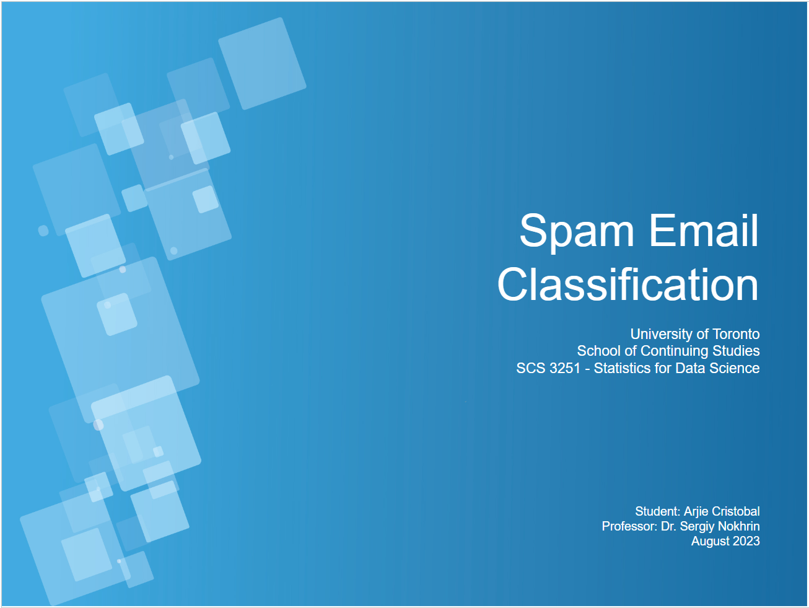
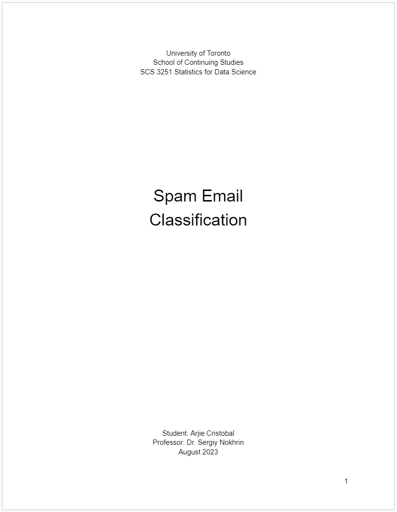

# Spam Email Classification
SCS 3251 Statistics for Data Science Project

Jupyter Notebooks:
* [Project Spambase](https://nbviewer.org/github/quickheaven/scs-3251-statistics-for-data-science/blob/5721d97fecd5b56f98a38e33a36ee0b459aff6af/project_spambase_nb.ipynb)
* [Spambase Dataset Loader](https://nbviewer.org/github/quickheaven/scs-3251-statistics-for-data-science/blob/5721d97fecd5b56f98a38e33a36ee0b459aff6af/spambase_dataset_loader_nb.ipynb)
* [Spambase Model Helper](https://nbviewer.org/github/quickheaven/scs-3251-statistics-for-data-science/blob/5721d97fecd5b56f98a38e33a36ee0b459aff6af/spambase_model_helper_nb.ipynb)

Team members:

| Name | Github Repo |
| --- | --- |
| Arjie Cristobal  | https://github.com/quickheaven |

## Introduction

### Spambase Dataset
The "spam" concept is diverse: advertisements for products/web sites, make money fast schemes, chain letters, pornography...
	
Our collection of spam e-mails came from our postmaster and individuals who had filed spam.  Our collection of non-spam e-mails came from filed work and personal e-mails, and hence the word 'george' and the area code '650' are indicators of non-spam.  These are useful when constructing a personalized spam filter.  One would either have to blind such non-spam indicators or get a very wide collection of non-spam to generate a general purpose spam filter.

### Dataset Source:

* Hopkins,Mark, Reeber,Erik, Forman,George, and Suermondt,Jaap. (1999). Spambase. UCI Machine Learning Repository. https://doi.org/10.24432/C53G6X.

Link: [Spambase](https://archive.ics.uci.edu/dataset/94/spambase)

## Presentation

## Report

